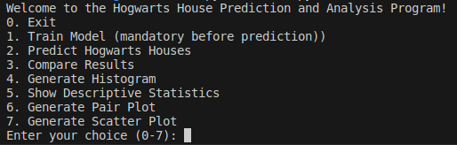
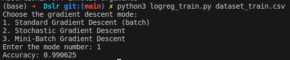
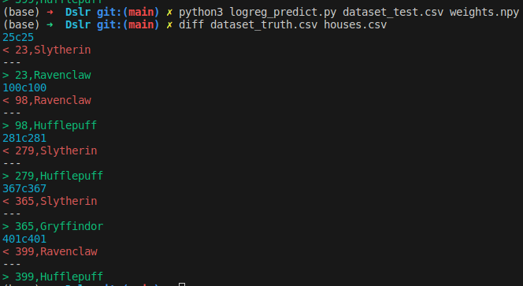
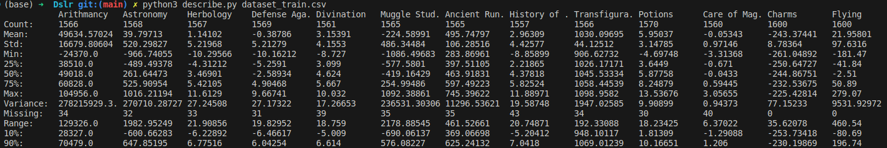
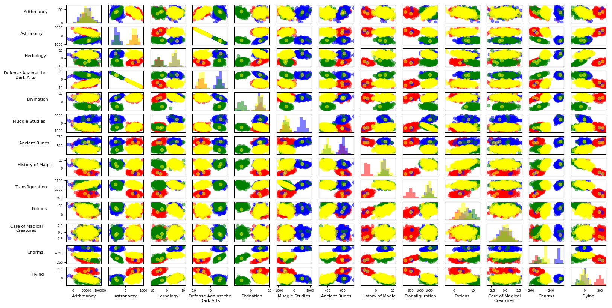
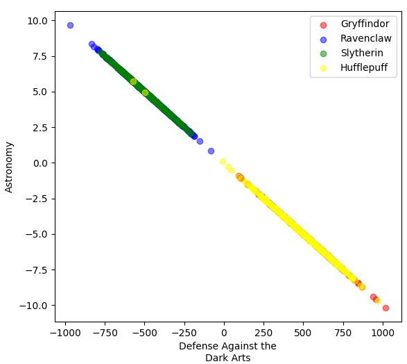
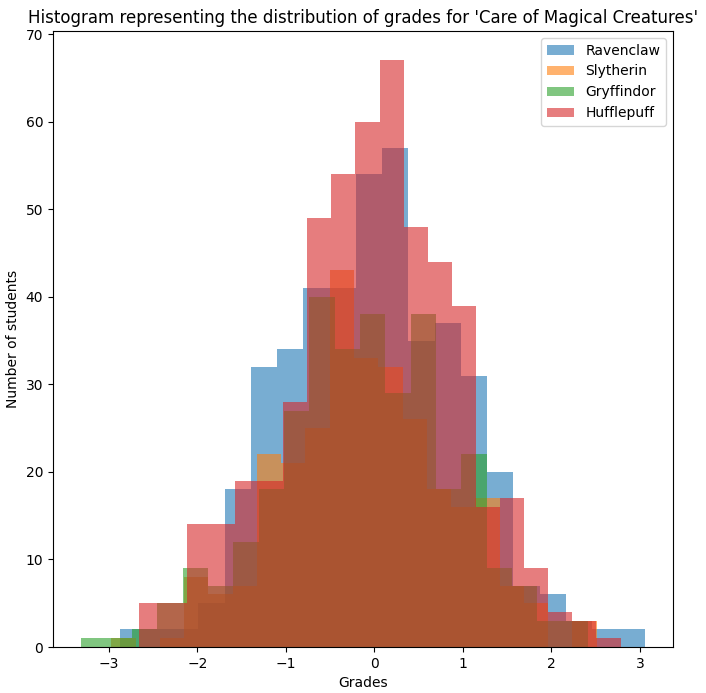

# DSLR
This project includes a set of Python scripts designed to predict the Hogwarts house of students based on various features, analyze their performances in different subjects, and visualize the data.

## Prerequisites

- Python 3.x
- Libraries: numpy, pandas, matplotlib
You can install these libraries using pip:
````
pip install numpy pandas matplotlib
````

## Files Description

1. logpredict.py: Predicts Hogwarts houses for students in a given dataset.
2. logtrain.py: Trains a logistic regression model to classify students into Hogwarts houses.
3. histogram.py: Generates histograms to visualize the distribution of students' grades.
4. describe.py: Provides statistical descriptions (mean, standard deviation, min/max, etc.) of features in the dataset.
5. pairplot.py & scatterplot.py: Visualize relationships between different features through pair plots and scatter plots.
6. utils.py: Some tools used by the others scripts.

## Usage Instructions

For easier use of the program, you can simply launch the menu:
````
python3 main.py
````



### I - Training the Model - MANDATORY
1. To train the model, run the logtrain.py script with the path to your training dataset:
````
python3 logtrain.py dataset_train.csv
````
2. Follow the prompts to choose the gradient descent mode.
3. The trained weights will be saved as weights.npy.


### II - Predicting Hogwarts Houses
1. After training, use logpredict.py to predict houses for a new dataset:
````
python3 logpredict.py dataset_test.csv weights.npy
````
2. The predictions will be saved in a file named houses.csv.
3. You can compare with the dataset_truth to test accuracy:
````
diff houses.csv dataset_truth.csv
````

**4 errors, on 400 tests -> 99% accuracy.**

### III - Data Analysis and Visualization
Run histogram.py, describe.py, pairplot.py, or scatterplot.py with your dataset:
````
python3 histogram.py dataset_train.csv
````
Replace histogram.py with the desired script's name.





----

## Definitions:

### Arithmetic Mean:
This is the most commonly used "average" and is the one referred to when using the term "average" without specifying the type. To calculate the arithmetic mean, **all values are added together and the result is divided by the total number of values**.

### Standard Deviation:
Standard deviation is a **measure of the amount of variation or dispersion in a set of values**. A low standard deviation indicates that the values tend to be close to the mean (also called the expected value) of the set, while a high standard deviation indicates that the values are spread over a wider range. The larger the standard deviation, the greater the dispersion of values around the mean. Standard deviation can be used to measure uncertainty or the reliability of data. For example, if we have two data groups with the same mean, the group with the larger standard deviation would have greater variability, which means we have less certainty about predicting a new value.

### Quartiles:
Quartiles are **values that divide a data set into quarters**. Thus, there are three points (Q1, Q2, and Q3) that divide the data set into four equal parts.

a. **The first quartile (Q1 or 25th percentile) is the value under which 25% of the data falls**.
In other words, Q1 is the number for which 25% of the data are lower and 75% of the data are higher.

b. **The second quartile (Q2 or 50th percentile or median) is the median value of the data set, under which 50% of the data falls**.
Half of the data are lower than the median and the other half higher.

c. **The third quartile (Q3 or 75th percentile) is the value under which 75% of the data falls**.
In other words, Q3 is the number for which 75% of the data are lower and 25% of the data are higher.

----

## I - TRAINING

### 1) LEARNING_RATE variable:
Also called the learning rate. **It determines how much the model adjusts or changes at each step of the learning process**.
If the learning rate is too high, the model may miss the optimal solution because it makes too large adjustments at each step. On the other hand, if the learning rate is too low, the model may take a long time to converge to the optimal solution, or even never get there, because it makes too small adjustments.
In other words, the learning rate controls the size of the "steps" you take in trying to reach the optimal solution.

### 2) NUM_ITERATIONS variable:
This parameter **defines the number of iterations, i.e., how many times the learning process is repeated**. Each iteration involves updating the model weights using the gradient of the loss function.
If the number of iterations is too small, the model may not have enough time to learn and converge to the optimal solution. If the number of iterations is too large, the model may overfit the training data, meaning it learns the training data so well that it loses performance when faced with new data.

### 3) train_test_split function
Divides the data set into two separate sets:

**a. Training set:**
This set is used to build and train the model. Practically, this means that the model uses these data **to learn the relationships between features** (sometimes called "independent variables" or "predictors") **and the target** (also called "dependent variable" or "label").

**b. Test set:**
This set is used to **evaluate the performance of the model**. It is not used during the training phase and thus acts as "unseen" data for the model. Comparing the model's predictions on the test set with the true values gives us a measure of the model's performance.

The train_test_split function performs this division. It takes as input the data X and y (respectively the features and the target), as well as test_size.
```test_size=0.2``` means that 20% of the data will be used for the test set, and thus the remaining 80% will make up the training set.

Finally, the random_state argument is a seed for the random number generator used to shuffle the data before splitting. This ensures that if you run the code multiple times, you will always get the same split, which can be useful for experiment reproducibility.

After shuffling the data, the train_test_split function simply divides the data into two sets based on test_size. It returns four arrays: X_train, X_test, y_train, y_test. These arrays represent respectively the training features, test features, training target, and test target.

### 4) normalize function
This normalization transforms your variables so that they have a mean of zero and a standard deviation of one. **It helps to prevent certain features from dominating others** simply because of their scale, it aids in faster convergence during learning, and it is a prerequisite for a number of machine learning algorithms.

**a. Calculating the mean and standard deviation:**
For each column (i.e., each feature) in the training set, the function calculates the mean (the average value) and the standard deviation (a measure of the dispersion of values).

**b. Subtracting the mean:**
For each value in the feature, the function subtracts the mean of that feature. This has the effect of centering the data around zero.

**c. Dividing by the standard deviation:**
Then, the function divides each value by the standard deviation of that feature. This has the effect of scaling the range of values for that feature so that the standard deviation is 1.

### 5) softmax function
The softmax function is used in the context of **multi-class classification, where you have more than two classes to predict**.
The softmax function takes a set of scores for each class (obtained by multiplying the data by a set of "weights" or coefficients for each class) and transforms them into probabilities. **Each probability indicates the chance that the input belongs to a certain class**.

**a. Exponential of scores:**
The function starts by taking the exponential of each score. The exponential is a mathematical function (e^x) which has the **useful property of always being positive**.

**b. Division by the sum:**
Then, each exponential score is divided by the sum of all the exponential scores. This has the effect of normalizing the scores so they add up to 1. **This is important because it allows the scores to be treated as probabilities**.

Thus, the output of the softmax function is a vector of probabilities: for each input, you have a probability for each class, and all these probabilities add up to 1.
**This can then be interpreted as the probability that the input belongs to each class.**
The reason we use the softmax function and not just direct conversion of scores into probabilities is that it amplifies the difference between high scores and low scores, making the model more confident in its predictions.

### 6) get_weights function
**This is the heart of the multi-class logistic regression script. This is where the model actually learns from the data.**

**a. Initialization:**
The function starts by initializing a few variables. It determines the number of classes (n_classes) and the number of samples (n_samples). Then, it initializes an array y_one_hot with zeros to store the classes of the training samples in a form called "one-hot encoding". This format allows representing each class by a vector with all elements zero except one which is equal to 1, the position of this 1 representing the class. For example, if there are four classes, class 2 can be represented as [0, 1, 0, 0]. Then, it initializes the model's "weights" with zeros. **These weights represent what the model has learned. Each weight indicates the importance of each feature for each class.**

**b. Training loop:**
The function then enters a loop that will last as many iterations as specified by NUM_ITERATIONS. In each iteration, the model:

- Makes a prediction
- Calculates the error of this prediction
- Adjusts the weights based on this error.

**c. Prediction:**
The prediction is made by multiplying the features (X_train) by the weights, which gives the "scores" for each class. These scores are then passed through the softmax function to obtain probabilities for each class.

**d. Error calculation:**
The error is calculated by comparing the predicted probabilities to the true class of each training sample. This is called the "loss" or cost. In this case, it uses "log loss", which is a commonly used measure for logistic regression.

**e. Updating weights:**
Finally, the function calculates the "gradient" of the error. **The gradient is a measure of the direction and intensity of the change needed to reduce the error**. The weights are then updated by moving in the opposite direction of the gradient, at a distance determined by LEARNING_RATE.

This training loop is repeated many times (determined by NUM_ITERATIONS), allowing the model to gradually learn from its mistakes and improve its predictions.
At the end of the training, the get_weights function returns the weights learned by the model, which will then be used to make predictions on new data.

## II - PREDICTION

### 1) Normalization
Transforms variables so that they have a mean of zero and a standard deviation of one. Helps to prevent certain features from dominating others simply because of their scale.

### 2) Prediction:
Scores for each class are calculated by multiplying the features by the model's weights. Then, the index of the class with the highest score is found for each.

----

**Authors are:**
- [Apyre / Leo Fresnay](https://github.com/Apyre83)
- [Jean-michel Bertin](https://github.com/jmbertin)
